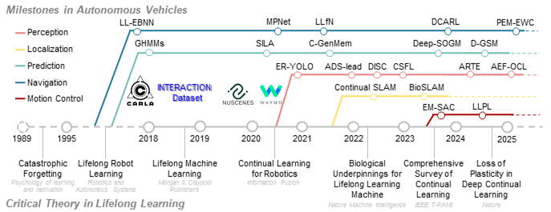

# Lifelong Learning for Autonomous Vehicles

This is the official repository of paper _''A Survey on Lifelong Learning for Autonomous Vehicles: Methods, Benchmarks, Challenges and Future Directions'', Yunlong Lin, Sizhe Fan, Tongshuai Wu, Chao Lu, and Jianwei Gong_. The paper is submitted to the journal _IEEE Transactions on Pattern Analysis and Machine Intelligence_ for peer review.

## Perception
|Title|Code|Venue|Date|
|:---|:---|:---|:---|
|[Lifelong change detection: Continuous domain adaptation for small object change detection in everyday robot navigation](https://hal.science/hal-04691842/document)|[LSTOL](https://github.com/RuiYang-1010/lstol)|IRSO|2024|
|[Online analytic exemplar-free continual learning with large models for imbalanced autonomous driving task](https://arxiv.org/pdf/2405.17779?)|AEF-OCL|TVT|2024|
|[Lifelong change detection: Continuous domain adaptation for small object change detection in everyday robot navigation](https://ieeexplore.ieee.org/abstract/document/10215686)|LCD|MAV|2023|
|[OpenNet: Incremental Learning for Autonomous Driving Object Detection with Balanced Loss](https://arxiv.org/pdf/2311.14939)|OpenNet|SMC|2023|
|[An efficient domain-incremental learning approach to drive in all weather conditions](https://openaccess.thecvf.com/content/CVPR2022W/V4AS/papers/Mirza_An_Efficient_Domain-Incremental_Learning_Approach_To_Drive_in_All_Weather_CVPRW_2022_paper.pdf)|[DISC](https://github.com/jmiemirza/dua)|CVPR|2022|
|[CLAIRE: enabling continual learning for real-time autonomous driving with a dual-head architecture](https://par.nsf.gov/servlets/purl/10357064)|CLAIRE|ISORC|2022|
|[CLAIRE: enabling continual learning for real-time autonomous driving with a dual-head architecture](https://par.nsf.gov/servlets/purl/10357064)|CLAIRE|ISORC|2022|
|[Continual learning strategy in one-stage object detection framework based on experience replay for autonomous driving vehicle](https://www.mdpi.com/1424-8220/20/23/6777/pdf)|ER-YOLO|Sensors|2020|
|[Adaptive robot traversability estimation based on self-supervised online continual learning in unstructured environments](https://ieeexplore.ieee.org/abstract/document/10494895)|[ARTE](https://github.com/RuiYang-1010/lstol)|RA-L|2024|
|[Taxonomy-aware continual semantic segmentation in hyperbolic spaces for open-world perception](https://arxiv.org/pdf/2407.18145?)|TOPICS|RA-L|2024|
|[ADS-lead: Lifelong anomaly detection in autonomous driving systems](https://tianweiz07.github.io/Papers/23-TITS.pdf)|ADS-Lead|T-ITS|2022|
|[Few-shot class-incremental learning via compact and separable features for fine-grained vehicle recognition](https://ieeexplore.ieee.org/abstract/document/9780261)|CSFL|T-ITS|2022|
## Localization
|Title|Code|Venue|Date|
|:---|:---|:---|:---|
|[Data-driven indoor positioning correction for infrastructure-enabled autonomous driving systems: A lifelong framework](https://research.tue.nl/files/295467404/Data_Driven_Indoor_Positioning_Correction_for_Infrastructure_Enabled_Autonomous_Driving_Systems_A_Lifelong_Framework.pdf)|[59]|T-ITS|2023|
|[Self-improving semantic perception for indoor localisation](https://proceedings.mlr.press/v164/blum22a/blum22a.pdf)|[[55]](https://github.com/ethz-asl/background_foreground_segmentation)|CoRL|2022|
|[Bioslam: A bioinspired lifelong memory system for general place recognition](https://arxiv.org/pdf/2208.14543)|BioSLAM|T-RO|2023|
|[Continual slam: Beyond lifelong simultaneous localization and mapping through continual learning](https://arxiv.org/pdf/2203.01578)|[CL-SLAM](https://github.com/robot-learning-freiburg/CL-SLAM)|ISRR|2022|
|[Cross-scene loop-closure detection with continual learning for visual simultaneous localization and mapping](https://journals.sagepub.com/doi/pdf/10.1177/17298814211050560)|[60]|IJARS|2021|
|[CCL: Continual contrastive learning for LiDAR place recognition](https://arxiv.org/pdf/2303.13952)|[CCL](https://github.com/cloudcjf/ccl)|RA-L|2023|
## Prediction
|Title|Code|Venue|Date|
|:---|:---|:---|:---|
|[Continual Learning for Motion Prediction Model via Meta-Representation Learning and Optimal Memory Buffer Retention Strategy](openaccess.thecvf.com/content/CVPR2024/papers/Kang_Continual_Learning_for_Motion_Prediction_Model_via_Meta-Representation_Learning_and_CVPR_2024_paper.pdf)|[72]|CVPR|2024|
|[Towards Zero-Forgetting Continual Learning for Interactive Trajectory Prediction: A Dynamically Expandable Approach](https://papers.ssrn.com/sol3/Delivery.cfm?abstractid=5042678)|DEITP|SSRN|2024|
|[DECODE: Domain-aware Continual Domain Expansion for Motion Prediction](https://arxiv.org/pdf/2411.17917?)|[DECODE](https://github.com/michigan-traffic-lab/DECODE)|arXiv|2024|
|[Continual interactive behavior learning with traffic divergence measurement: A dynamic gradient scenario memory approach](https://arxiv.org/pdf/2212.11167)|[D-GSM](https://github.com/BIT-Jack/D-GSM)|T-ITS|2023|
|[Lifelong vehicle trajectory prediction framework based on generative replay](https://arxiv.org/pdf/2111.07511)|[R2GAN](https://github.com/cliffbao/grtp)|T-ITS|2023|
|[Continual pedestrian trajectory learning with social generative replay](https://research.tue.nl/files/273673573/Continual_Pedestrian_Trajectory_Learning_With_Social_Generative_Replay.pdf)|[CL-SGR](https://github.com/tue-mps/cptl_with_social_gr)|RA-L|2022|
|[Continual multi-agent interaction behavior prediction with conditional generative memory](https://jiachenli94.github.io/publications/Mix/RAL2021.pdf)|C-GenMem|RA-L|2021|
|[SILA: An incremental learning approach for pedestrian trajectory prediction](https://openaccess.thecvf.com/content_CVPRW_2020/papers/w66/Habibi_SILA_An_Incremental_Learning_Approach_for_Pedestrian_Trajectory_Prediction_CVPRW_2020_paper.pdf)|SILA|CVPR|2020|
|[Learning to predict navigational patterns from partial observations](https://ieeexplore.ieee.org/iel7/7083369/10185095/10171996.pdf)|[[65]](https://github.com/robin-karlsson0/dslp)|RA-L|2023|
|[Self-supervised traffic advisors: distributed, multi-view traffic prediction for smart cities](https://arxiv.org/pdf/2204.06171)|[SSTA](https://github.com/Jiankai-Sun/SSTA_ITSC_2022)|ITSC|2022|
|[The foreseeable future: Self-supervised learning to predict dynamic scenes for indoor navigation](https://arxiv.org/pdf/2208.12602)|[Deep-SOGM](https://github.com/utiasasrl/crystal_ball_nav)|T-RO|2023|
|[Learning spatiotemporal occupancy grid maps for lifelong navigation in dynamic scenes](https://arxiv.org/pdf/2108.10585)|[[69]](https://github.com/utiasASRL/Deep-Collison-Checker)|ICRA|2022|
## Planning
|Title|Code|Venue|Date|
|:---|:---|:---|:---|
|[Cross-Scenario End-to-End Motion Planning in Off-Road Environment: A Lifelong Learning Perspective](https://ieeexplore.ieee.org/abstract/document/10839320)|[75]|RA-L|2025|
|[A lifelong learning approach to mobile robot navigation](https://ieeexplore.ieee.org/abstract/document/9345478)|[LLfN](https://github.com/Cranial-XIX/LifelongLearningforNavigation)|RA-L|2021|
|[Motion planning networks: Bridging the gap between learning-based and classical motion planners](https://arxiv.org/pdf/1907.06013)|[MPNet](https://github.com/ahq1993/MPNet)|T-RO|2020|
|[Incremental lifelong deep learning for autonomous vehicles](https://ieeexplore.ieee.org/abstract/document/8569992/)|CBIL|ITSC|2018|
|[Human-guided continual learning for personalized decision-making of autonomous driving](https://ieeexplore.ieee.org/abstract/document/10844014/)|[78]|T-ITS|2025|
|[DNN patching: progressive fixing and augmenting the functionalities of DNNs for autonomous vehicles](https://ieeexplore.ieee.org/abstract/document/9691893)|DNN Patching|RA-L|2022|
|[Lifelong federated reinforcement learning: A learning architecture for navigation in cloud robotic systems](https://arxiv.org/pdf/1901.06455)|LFRL|RA-L|2019|
|[A rapid adapting and continual learning spiking neural network path planning algorithm for mobile robots](https://arxiv.org/pdf/2404.15524)|E-SWP|RA-L|2024|
|[Lifelong topological visual navigation](https://arxiv.org/pdf/2110.08488)|[81]|RA-L|2022|
|[Lifelong multi-agent path finding in large-scale warehouses](https://ojs.aaai.org/index.php/AAAI/article/download/17344/17151)|[RHCR](https://github.com/Jiaoyang-Li/RHCR)|AAAI|2021|
## Motion control
|Title|Code|Venue|Date|
|:---|:---|:---|:---|
|[Beyond imitation: A life-long policy learning framework for path tracking control of autonomous driving](https://arxiv.org/pdf/2404.17198)|LLPL|TVT|2024|
|[Continual reinforcement learning for autonomous driving with application on velocity control under various environment](https://drive.google.com/file/d/1JC269VOTrBDnEGDuO6SI5UHJ2OPe1q3P/view)|EM-SAC|CVCI|2023|
|[Continual learning for adaptable car-following in dynamic traffic environments](https://arxiv.org/pdf/2407.14247)|[85]|TISC|2024|
