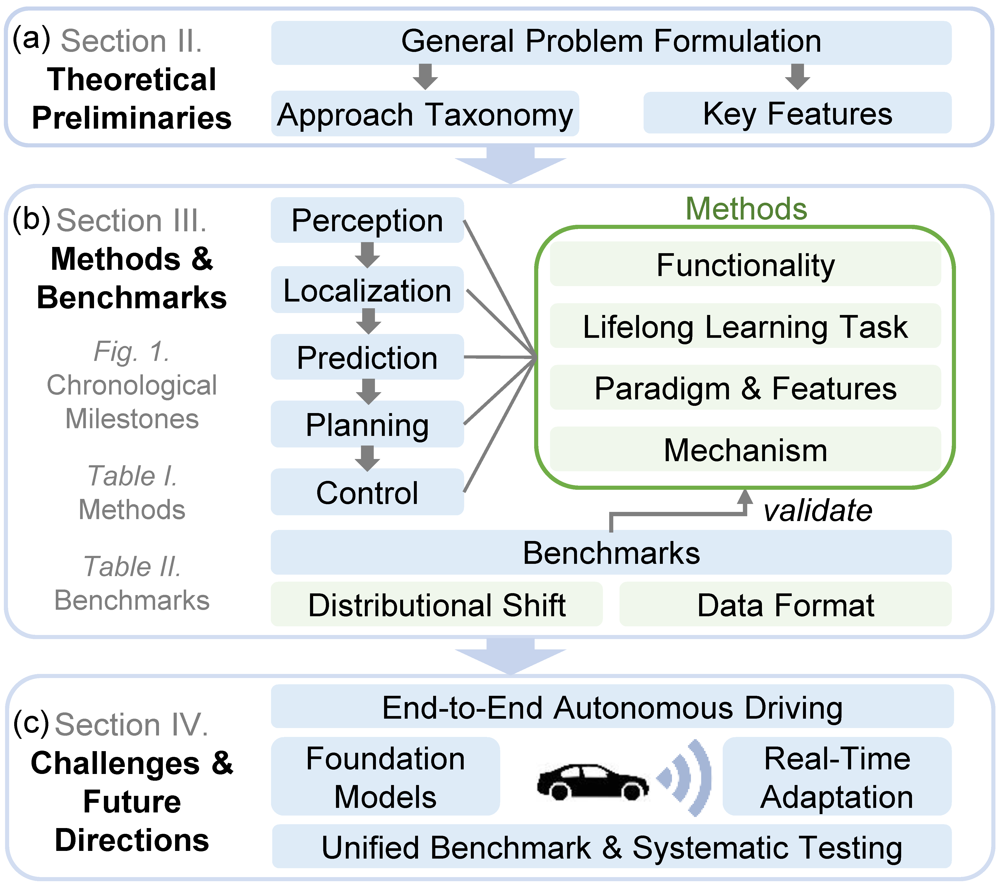

# Lifelong Learning for Autonomous Vehicles

This is the official repository of paper _''A Survey on Lifelong Learning for Autonomous Vehicles: Methods, Benchmarks, Challenges and Future Directions'', Yunlong Lin, Sizhe Fan, Tongshuai Wu, Chao Lu, and Jianwei Gong_. The paper is submitted to the journal _IEEE Transactions on Pattern Analysis and Machine Intelligence_ for peer review.

## Perception
|Title|Method(Code)|Journal/Conference|Year|
|:---|:---|:---|:---|
|[Adaptive robot traversability estimation based on self-supervised online continual learning in unstructured environments](https://ieeexplore.ieee.org/abstract/document/10494895)|[ARTE](https://github.com/RuiYang-1010/lstol)|IEEE RA-L|2024|
|[Taxonomy-aware continual semantic segmentation in hyperbolic spaces for open-world perception](https://arxiv.org/pdf/2407.18145?)|TOPICS|IEEE RA-L|2024|
|[Online analytic exemplar-free continual learning with large models for imbalanced autonomous driving task](https://arxiv.org/pdf/2405.17779?)|AEF-OCL|IEEE T-VT|2024|
|[Preventing Catastrophic Forgetting in Continuous Online Learning for Autonomous Driving](https://hal.science/hal-04691842/document)|[LSTOL](https://github.com/RuiYang-1010/lstol)|IRSO|2024|
|[Lifelong change detection: Continuous domain adaptation for small object change detection in everyday robot navigation](https://ieeexplore.ieee.org/abstract/document/10215686)|LCD|MAV|2023|
|[OpenNet: Incremental Learning for Autonomous Driving Object Detection with Balanced Loss](https://arxiv.org/pdf/2311.14939)|OpenNet|SMC|2023|
|[An efficient domain-incremental learning approach to drive in all weather conditions](https://openaccess.thecvf.com/content/CVPR2022W/V4AS/papers/Mirza_An_Efficient_Domain-Incremental_Learning_Approach_To_Drive_in_All_Weather_CVPRW_2022_paper.pdf)|[DISC](https://github.com/jmiemirza/dua)|CVPR|2022|
|[ADS-lead: Lifelong anomaly detection in autonomous driving systems](https://tianweiz07.github.io/Papers/23-TITS.pdf)|ADS-Lead|IEEE T-ITS|2022|
|[Few-shot class-incremental learning via compact and separable features for fine-grained vehicle recognition](https://ieeexplore.ieee.org/abstract/document/9780261)|CSFL|IEEE T-ITS|2022|
|[CLAIRE: enabling continual learning for real-time autonomous driving with a dual-head architecture](https://par.nsf.gov/servlets/purl/10357064)|CLAIRE|ISORC|2022|
|[Continual learning strategy in one-stage object detection framework based on experience replay for autonomous driving vehicle](https://www.mdpi.com/1424-8220/20/23/6777/pdf)|ER-YOLO|Sensors|2020|
## Localization
|Title|Method(Code)|Journal/Conference|Year|
|:---|:---|:---|:---|
|[CCL: Continual contrastive learning for LiDAR place recognition](https://arxiv.org/pdf/2303.13952)|[CCL](https://github.com/cloudcjf/ccl)|IEEE RA-L|2023|
|[Data-driven indoor positioning correction for infrastructure-enabled autonomous driving systems: A lifelong framework](https://research.tue.nl/files/295467404/Data_Driven_Indoor_Positioning_Correction_for_Infrastructure_Enabled_Autonomous_Driving_Systems_A_Lifelong_Framework.pdf)|-|IEEE T-ITS|2023|
|[Bioslam: A bioinspired lifelong memory system for general place recognition](https://arxiv.org/pdf/2208.14543)|BioSLAM|IEEE T-RO|2023|
|[Self-improving semantic perception for indoor localisation](https://proceedings.mlr.press/v164/blum22a/blum22a.pdf)|[code](https://github.com/ethz-asl/background_foreground_segmentation)|CoRL|2022|
|[Continual slam: Beyond lifelong simultaneous localization and mapping through continual learning](https://arxiv.org/pdf/2203.01578)|[CL-SLAM](https://github.com/robot-learning-freiburg/CL-SLAM)|ISRR|2022|
|[Cross-scene loop-closure detection with continual learning for visual simultaneous localization and mapping](https://journals.sagepub.com/doi/pdf/10.1177/17298814211050560)|-|IJARS|2021|
## Prediction
|Title|Method(Code)|Journal/Conference|Year|
|:---|:---|:---|:---|
|[Continual Learning for Motion Prediction Model via Meta-Representation Learning and Optimal Memory Buffer Retention Strategy](openaccess.thecvf.com/content/CVPR2024/papers/Kang_Continual_Learning_for_Motion_Prediction_Model_via_Meta-Representation_Learning_and_CVPR_2024_paper.pdf)|-|CVPR|2024|
|[Towards Zero-Forgetting Continual Learning for Interactive Trajectory Prediction: A Dynamically Expandable Approach](https://papers.ssrn.com/sol3/Delivery.cfm?abstractid=5042678)|DEITP|SSRN|2024|
|[DECODE: Domain-aware Continual Domain Expansion for Motion Prediction](https://arxiv.org/pdf/2411.17917?)|[DECODE](https://github.com/michigan-traffic-lab/DECODE)|arXiv|2024|
|[Learning to predict navigational patterns from partial observations](https://ieeexplore.ieee.org/iel7/7083369/10185095/10171996.pdf)|[code](https://github.com/robin-karlsson0/dslp)|IEEE RA-L|2023|
|[Continual interactive behavior learning with traffic divergence measurement: A dynamic gradient scenario memory approach](https://arxiv.org/pdf/2212.11167)|[D-GSM](https://github.com/BIT-Jack/D-GSM)|IEEE T-ITS|2023|
|[Lifelong vehicle trajectory prediction framework based on generative replay](https://arxiv.org/pdf/2111.07511)|[R2GAN](https://github.com/cliffbao/grtp)|IEEE T-ITS|2023|
|[The foreseeable future: Self-supervised learning to predict dynamic scenes for indoor navigation](https://arxiv.org/pdf/2208.12602)|[Deep-SOGM](https://github.com/utiasasrl/crystal_ball_nav)|IEEE T-RO|2023|
|[Learning spatiotemporal occupancy grid maps for lifelong navigation in dynamic scenes](https://arxiv.org/pdf/2108.10585)|[code](https://github.com/utiasASRL/Deep-Collison-Checker)|ICRA|2022|
|[Self-supervised traffic advisors: distributed, multi-view traffic prediction for smart cities](https://arxiv.org/pdf/2204.06171)|[SSTA](https://github.com/Jiankai-Sun/SSTA_ITSC_2022)|IEEE ITSC|2022|
|[Continual pedestrian trajectory learning with social generative replay](https://research.tue.nl/files/273673573/Continual_Pedestrian_Trajectory_Learning_With_Social_Generative_Replay.pdf)|[CL-SGR](https://github.com/tue-mps/cptl_with_social_gr)|IEEE RA-L|2022|
|[Continual multi-agent interaction behavior prediction with conditional generative memory](https://jiachenli94.github.io/publications/Mix/RAL2021.pdf)|C-GenMem|IEEE RA-L|2021|
|[SILA: An incremental learning approach for pedestrian trajectory prediction](https://openaccess.thecvf.com/content_CVPRW_2020/papers/w66/Habibi_SILA_An_Incremental_Learning_Approach_for_Pedestrian_Trajectory_Prediction_CVPRW_2020_paper.pdf)|SILA|CVPR|2020|
## Planning
|Title|Method(Code)|Journal/Conference|Year|
|:---|:---|:---|:---|
|[A rapid adapting and continual learning spiking neural network path planning algorithm for mobile robots](https://arxiv.org/pdf/2404.15524)|E-SWP|IEEE RA-L|2024|
|[Self-improving semantic perception for indoor localisation](https://proceedings.mlr.press/v164/blum22a/blum22a.pdf)|[-](https://github.com/ethz-asl/background_foreground_segmentation)|CoRL|2022|
|[DNN patching: progressive fixing and augmenting the functionalities of DNNs for autonomous vehicles](https://ieeexplore.ieee.org/abstract/document/9691893)|DNN Patching|IEEE RA-L|2022|
|[Lifelong multi-agent path finding in large-scale warehouses](https://ojs.aaai.org/index.php/AAAI/article/download/17344/17151)|[RHCR](https://github.com/Jiaoyang-Li/RHCR)|AAAI|2021|
|[A lifelong learning approach to mobile robot navigation](https://ieeexplore.ieee.org/abstract/document/9345478)|[LLfN](https://github.com/Cranial-XIX/LifelongLearningforNavigation)|IEEE RA-L|2021|
|[Motion planning networks: Bridging the gap between learning-based and classical motion planners](https://arxiv.org/pdf/1907.06013)|[MPNet](https://github.com/ahq1993/MPNet)|IEEE T-RO|2020|
|[Lifelong federated reinforcement learning: A learning architecture for navigation in cloud robotic systems](https://arxiv.org/pdf/1901.06455)|LFRL|IEEE RA-L|2019|
|[Incremental lifelong deep learning for autonomous vehicles](https://ieeexplore.ieee.org/abstract/document/8569992/)|CBIL|IEEE ITSC|2018|
## Motion control
|Title|Method(Code)|Journal/Conference|Year|
|:---|:---|:---|:---|
|[Beyond imitation: A life-long policy learning framework for path tracking control of autonomous driving](https://arxiv.org/pdf/2404.17198)|LLPL|IEEE T-VT|2024|
|[Continual reinforcement learning for autonomous driving with application on velocity control under various environment](https://drive.google.com/file/d/1JC269VOTrBDnEGDuO6SI5UHJ2OPe1q3P/view)|EM-SAC|CVCI|2023|
|[Self-improving semantic perception for indoor localisation](https://proceedings.mlr.press/v164/blum22a/blum22a.pdf)|[-](https://github.com/ethz-asl/background_foreground_segmentation)|CoRL|2022|
## Dataset
|Title|Resource Link|Journal/Conference|Year|
|:---|:---|:---|:---|
|[Coda: A real-world road corner case dataset for object detection in autonomous driving](https://arxiv.org/pdf/2203.07724)|[CODA](https://coda-dataset.github.io/)|ECCV|2022|
|[Alita: A large-scale incremental dataset for long-term autonomy](https://arxiv.org/pdf/2205.10737)|[ALITA](https://metaslam.github.io/datasets/alita/)|arXiv|2022|
|[One thousand and one hours: Self-driving motion prediction dataset](https://proceedings.mlr.press/v155/houston21a/houston21a.pdf)|[Lyft](https://medium.com/wovenplanetlevel5/unlocking-access-to-self-driving-research-the-lyft-level-5-dataset-and-competition-d487c27b1b6c)|CoRL|2021|
|[SODA10M: A large-scale 2D self/semi-supervised object detection dataset for autonomous driving](https://arxiv.org/pdf/2106.11118)|[SODA 10M](https://soda-2d.github.io/download.html)|arXiv|2021|
|[Scalability in perception for autonomous driving: Waymo open dataset](https://openaccess.thecvf.com/content_CVPR_2020/papers/Sun_Scalability_in_Perception_for_Autonomous_Driving_Waymo_Open_Dataset_CVPR_2020_paper.pdf)|[Waymo](https://waymo.com/open/)|CVPR|2020|
|[nuscenes: A multimodal dataset for autonomous driving](https://openaccess.thecvf.com/content_CVPR_2020/papers/Caesar_nuScenes_A_Multimodal_Dataset_for_Autonomous_Driving_CVPR_2020_paper.pdf)|[nuScense](https://www.nuscenes.org/)|CVPR|2020|
|[Mulran: Multimodal range dataset for urban place recognition](https://gisbi-kim.github.io/publications/gkim-2020-icra.pdf)|[MulRan](https://sites.google.com/view/mulran-pr/dataset)|ICRA|2020|
|[The round dataset: A drone dataset of road user trajectories at roundabouts in germany](https://ieeexplore.ieee.org/abstract/document/9294728/)|[rounD](https://levelxdata.com/round-dataset/)|IEEE ITSC|2020|
|[The ind dataset: A drone dataset of naturalistic road user trajectories at german intersections](https://arxiv.org/pdf/1911.07602)|[inD](https://levelxdata.com/ind-dataset/)|IEEE IV|2020|
|[A large-scale frontal vehicle image dataset for fine-grained vehicle categorization](https://ieeexplore.ieee.org/abstract/document/9226061)|[Frontal-58](https://github.com/vision-insight/Frontal-103)|IEEE T-ITS|2020|
|[Interaction dataset: An international, adversarial and cooperative motion dataset in interactive driving scenarios with semantic maps](https://arxiv.org/pdf/1910.03088)|[INTERACTION](https://interaction-dataset.com/)|arXiv|2019|
|[The highd dataset: A drone dataset of naturalistic vehicle trajectories on german highways for validation of highly automated driving systems](https://arxiv.org/pdf/1810.05642)|[highD](https://levelxdata.com/highd-dataset/)|IEEE ITSC|2018|
|[Tusimple-benchmark lane detection](None)|[Tusimple](https://github.com/TuSimple/tusimple-benchmark/tree/master/doc/lane_detection)|CVPR|2017|
|[The mapillary vistas dataset for semantic understanding of street scenes](https://openaccess.thecvf.com/content_ICCV_2017/papers/Neuhold_The_Mapillary_Vistas_ICCV_2017_paper.pdf)|[Mapillary Vistas 2.0](https://www.mapillary.com/dataset/vistas)|ICCV|2017|
|[1 year, 1000 km: The oxford robotcar dataset](https://ora.ox.ac.uk/objects/uuid:c5266bad-e0f8-49f1-918e-1602ef935990/download_file?file_format=pdf&safe_filename=1%2BYear%252C%2B1000km-%2BThe%2BOxford%2BRobotCar%2BDataset.pdf&type_of_work=Journal+article)|[Oxford RobotCar](https://robotcar-dataset.robots.ox.ac.uk/downloads/)|IJRL|2017|
|[The cityscapes dataset for semantic urban scene understanding](https://openaccess.thecvf.com/content_cvpr_2016/papers/Cordts_The_Cityscapes_Dataset_CVPR_2016_paper.pdf)|[Cityscapes](https://www.cityscapes-dataset.com/)|CVPR|2016|
|[A large-scale car dataset for fine-grained categorization and verification](:https://www.cv-foundation.org/openaccess/content_cvpr_2015/papers/Yang_A_Large-Scale_Car_2015_CVPR_paper.pdf)|[Compars](http://mmlab.ie.cuhk.edu.hk/datasets/comp_cars/index.html)|CVPR|2015|
|[Microsoft coco: Common objects in context](https://arxiv.org/pdf/1405.0312)|[COCO](https://cocodataset.org/#home)|ECCV|2014|
|[3d object representations for fine-grained categorization](https://www.cv-foundation.org/openaccess/content_iccv_workshops_2013/W19/papers/Krause_3D_Object_Representations_2013_ICCV_paper.pdf)|[StanfordCars](https://ai.stanford.edu/~jkrause/cars/car_dataset.html)|ICCV|2013|
|[Are we ready for autonomous driving? the kitti vision benchmark suite](https://www.jimmyren.com/papers/rrc_kitti.pdf)|[KITTY](https://www.cvlibs.net/datasets/kitti/)|CVPR|2012|
|[Indoor segmentation and support inference from rgbd images](https://www.microsoft.com/en-us/research/wp-content/uploads/2016/11/shkf_eccv2012.pdf)|[NYU-Depth V2](https://cs.nyu.edu/~fergus/datasets/nyu_depth_v2.html)|ECCV|2012|
|[The German traffic sign recognition benchmark: a multi-class classification competition](https://www.researchgate.net/profile/Marc-Schlipsing/publication/224260296_The_German_Traffic_Sign_Recognition_Benchmark_A_multi-class_classification_competition/links/0fcfd508564a68aa76000000/The-German-Traffic-Sign-Recognition-Benchmark-A-multi-class-classification-competition.pdf)|[GTSRB](https://benchmark.ini.rub.de/gtsrb_dataset.html)|IJCNN|2011|
|[The Pascal Visual Object Classes (VOC) Challenge](https://www.pure.ed.ac.uk/ws/portalfiles/portal/7879113/ijcv_voc09.pdf)|[PASCAL VOC 2007](http://host.robots.ox.ac.uk/pascal/VOC/voc2007/)|IJCV|2010|
|[You'll never walk alone: Modeling social behavior for multi-target tracking](https://ethz.ch/content/dam/ethz/special-interest/baug/igp/photogrammetry-remote-sensing-dam/documents/pdf/pellegrini09iccv.pdf)|[ETH](https://data.vision.ee.ethz.ch/cvl/aem/ewap_dataset_full.tgz)|ICCV|2009|
|[Crowds by example](https://citeseerx.ist.psu.edu/document?repid=rep1&type=pdf&doi=3921f459a9ee26827963abc4abf013b4cc9cbd32)|[UCY](https://graphics.cs.ucy.ac.cy/research/downloads/crowd-data)|Computer Graphics Forum|2007|
|[The next generation simulation program](https://www.proquest.com/openview/25734e9b4c6254af9247b4fd888ef86e/1?pq-origsite=gscholar&cbl=42116)|[NGSIM](https://data.transportation.gov/Automobiles/Next-Generation-Simulation-NGSIM-Vehicle-Trajector/8ect-6jqj/about_data)|ITE|2004|
## Simulator
|Title|Resource Link|Journal/Conference|Year|
|:---|:---|:---|:---|
|[Lgsvl simulator: A high fidelity simulator for autonomous driving](https://arxiv.org/pdf/2005.03778)|[LGSVL](https://github.com/lgsvl/simulator)|IEEE ITSC|2020|
|[Gibson env: Real-world perception for embodied agents](https://openaccess.thecvf.com/content_cvpr_2018/papers/Xia_Gibson_Env_Real-World_CVPR_2018_paper.pdf)|[Gibson](https://github.com/StanfordVL/GibsonEnv)|CVPR|2018|
|[CARLA: An open urban driving simulator](https://proceedings.mlr.press/v78/dosovitskiy17a/dosovitskiy17a.pdf)|[CARLA](https://github.com/carla-simulator/carla)|CoRL|2017|
|[Design and use paradigms for gazebo, an open-source multi-robot simulator](https://web.archive.org/web/20170809185529id_/http://robotics.usc.edu/publications/media/uploads/pubs/394.pdf)|[Gazebo](https://gazebosim.org/home)|IRSO|2004|

